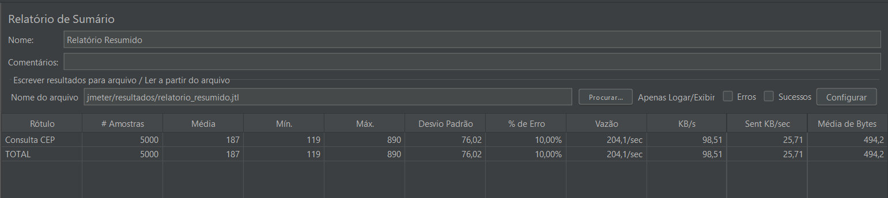
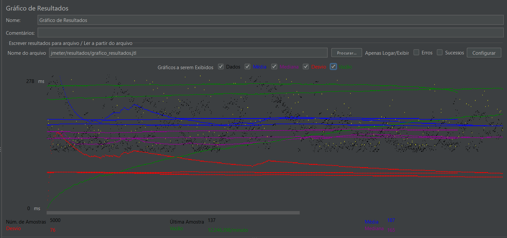
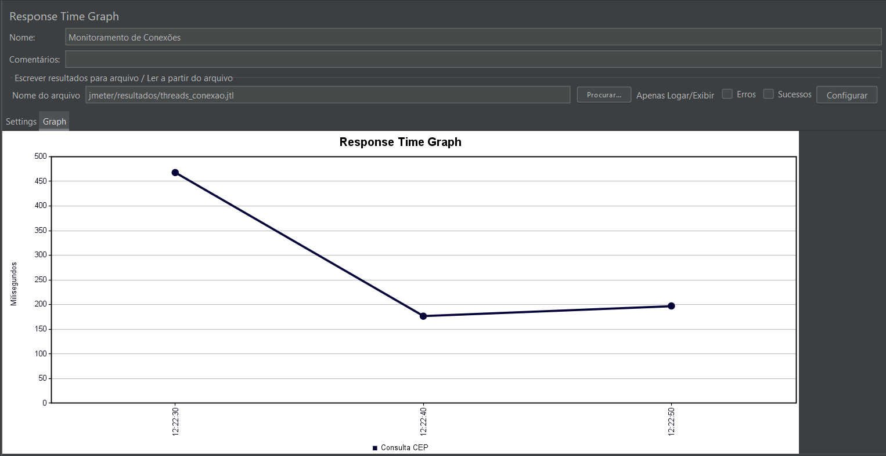
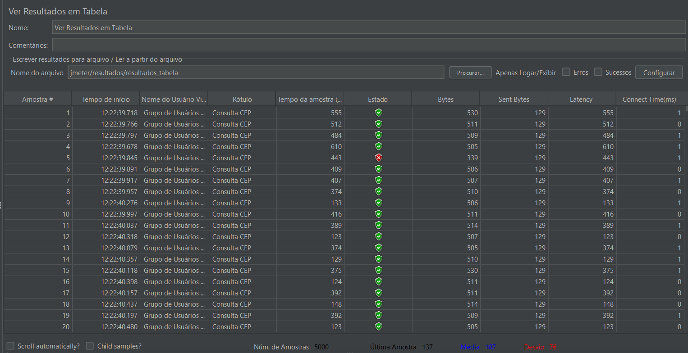

# API de Consulta ViaCEP

Esta API permite consultar informações de endereços a partir de CEPs utilizando o serviço ViaCEP.

## Inicializando o Projeto

### Instalação de Dependências
```bash
# Usando npm
npm install

# Ou usando yarn
yarn install
```

### Executando a API
```bash
# Usando npm
npm run dev

# Ou usando yarn
yarn dev
```

O servidor será iniciado na porta 3333.

## Endpoints da API

### Consultar CEP
```
GET /cep/:cep
```

Onde `:cep` é o CEP a ser consultado (apenas números).

#### Exemplo de Requisição
```
GET http://localhost:3333/cep/01001000
```

#### Exemplo de Resposta
```json
{
  "cep": "01001-000",
  "logradouro": "Praça da Sé",
  "complemento": "lado ímpar",
  "bairro": "Sé",
  "localidade": "São Paulo",
  "uf": "SP",
  "ibge": "3550308",
  "gia": "1004",
  "ddd": "11",
  "siafi": "7107"
}
```

## Relatório de Teste de Desempenho

### Endpoint Testado
```
GET /cep/:cep
```

### Parâmetros do Teste
- **Number of Threads:** 500 (Número de usuários simultâneos)
- **Ramp-Up Period:** 20 segundos (Tempo para iniciar os usuários)
- **Loop Count:** 10 (Número total de iterações para cada thread)

### Resultados do Teste

#### Tempo de Resposta
- **Tempo de Resposta Médio:** 187 ms
- **Tempo de Resposta Mínimo:** 119 ms
- **Tempo de Resposta Máximo:** 890 ms
- **Throughput:** 204,1 requisições/segundo

#### Erro Percentual
- **Error %:** 10,00%

#### Pico de Conexões Ativas
O teste atingiu 500 conexões ativas simultâneas conforme configuração do teste.

### Gráficos de Desempenho

#### Relatório de Sumário


#### Gráfico de Resultados


#### Response Time Graph


#### Resultados em Tabela


### Conclusão

O teste de carga na API de consulta de CEP demonstrou um desempenho satisfatório com 500 usuários simultâneos. O tempo médio de resposta de 187ms está dentro de parâmetros aceitáveis para uma API de consulta.

O throughput de 204,1 requisições por segundo indica boa capacidade de processamento. Já os tempos de resposta mostram variação significativa (119ms a 890ms), o que é esperado sob carga elevada, mas o tempo médio manteve-se em níveis aceitáveis.
